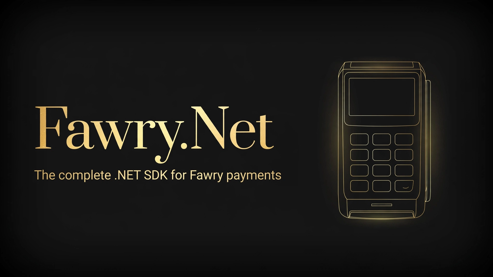

[](LICENSE)
[](https://dotnet.microsoft.com/)
[](https://github.com/SENESO/Fawry.Net/stargazers)
[](https://www.nuget.org/packages/Fawry.Net)
[](https://github.com/SENESO/Fawry.Net/actions/workflows/ci.yml)

# Fawry.Net

The missing .NET SDK for **Fawry** — Egypt's largest payment network.

Create Pay-at-Fawry reference numbers (cash at 300k+ outlets), charge cards
(immediate or authorize-then-capture), take mobile-wallet payments, capture and
cancel authorizations, and verify payment callbacks. Request signing follows
Fawry's official documentation exactly — you never hand-roll a signature again.

Targets `netstandard2.0` and `net8.0`. Only `System.Text.Json` (+ DI abstractions).
Bring your own `HttpClient`.

## Install

```bash
dotnet add package Fawry.Net
```

Or clone and reference the project:

```bash
git clone https://github.com/SENESO/Fawry.Net.git
```

## Quickstart

```csharp
using Fawry;
using Fawry.Models;

var client = new FawryClient(new FawryClientOptions
{
    MerchantCode = "<your-merchant-code>",
    SecureKey = "<your-secure-key>",
    // BaseUrl defaults to staging. Go live with:
    // BaseUrl = FawryClientOptions.ProductionBaseUrl
});

// Pay-at-Fawry: customer pays cash at any outlet with the reference number
var charge = await client.ChargePayAtFawryAsync(new ChargeRequest
{
    MerchantRefNum = Guid.NewGuid().ToString("N"), // unique per charge
    CustomerName = "Ahmed Ali",
    CustomerMobile = "01234567891",
    CustomerEmail = "ahmed@example.com",
    Amount = 580.55m,
    ChargeItems =
    {
        new ChargeItem { ItemId = "sku-1", Description = "Blue T-shirt", Price = 580.55m, Quantity = 1 }
    }
});

Console.WriteLine(charge.ReferenceNumber); // <-- customer pays with this
```

## API reference

### Charges

```csharp
// Pay-at-Fawry (cash at outlets)
Task<ChargeResponse> ChargePayAtFawryAsync(ChargeRequest request, CancellationToken ct = default)

// Mobile wallet (e.g. Vodafone Cash) — customer approves on their phone
Task<ChargeResponse> ChargeMobileWalletAsync(ChargeRequest request, CancellationToken ct = default)

// Card payment. Set AuthCaptureMode = true to authorize now and capture later.
Task<ChargeResponse> ChargeCardAsync(CardChargeRequest request, CancellationToken ct = default)
```

Card example (authorize now, capture on shipment):

```csharp
var auth = await client.ChargeCardAsync(new CardChargeRequest
{
    MerchantRefNum = Guid.NewGuid().ToString("N"),
    CustomerName = "Ahmed Ali",
    CustomerMobile = "01234567891",
    CustomerEmail = "ahmed@example.com",
    Amount = 1200.00m,
    CardNumber = "4242424242424242",
    CardExpiryYear = "27",
    CardExpiryMonth = "05",
    Cvv = "123",
    AuthCaptureMode = true, // hold the funds, capture later
    ChargeItems = { new ChargeItem { ItemId = "sku-2", Description = "Laptop", Price = 1200.00m, Quantity = 1 } }
});

// ... when you ship:
var capture = await client.CaptureAsync(auth.MerchantRefNumber); // full amount
var partial = await client.CaptureAsync(auth.MerchantRefNumber, 800.00m); // partial

// or release the hold:
var cancel = await client.CancelAuthorizationAsync(auth.MerchantRefNumber);
```

### Callbacks — always verify

```csharp
[HttpPost("api/fawry/callback")]
public IActionResult Callback([FromBody] ChargeResponse callback)
{
    if (!client.VerifyCallbackSignature(callback))
        return Unauthorized(); // constant-time SHA-256 comparison

    if (callback.IsPaid)
    {
        // fulfill order callback.MerchantRefNumber ...
    }
    return Ok();
}
```

Never trust callback query params alone — verify the signature first.

### ASP.NET Core DI

```csharp
services.AddFawry(options =>
{
    options.MerchantCode = builder.Configuration["Fawry:MerchantCode"];
    options.SecureKey = builder.Configuration["Fawry:SecureKey"];
    options.BaseUrl = FawryClientOptions.ProductionBaseUrl;
});

// then inject FawryClient anywhere
```

### Errors

Non-200 responses throw `FawryApiException` with `StatusCode`
(e.g. `"9946"` = blank or invalid signature), `StatusDescription`,
and the raw `ResponseBody`.

## Staging vs production

| Environment | Base URL |
|---|---|
| Staging (default) | `https://atfawry.fawrystaging.com` |
| Production | `https://www.atfawry.com` |

Set `FawryClientOptions.BaseUrl` accordingly. Test credentials come from the
FawryPay team during account setup.

## Notes & honesty

- Signature recipes were taken from Fawry's official docs
  ([developer.fawrystaging.com](https://developer.fawrystaging.com), "Authorize and
  Capture Payments" + charge API pages, verified Oct 2026). Card charges use the
  card-inclusive recipe from those docs.
- Amounts are sent as two-decimal strings (`"580.55"`), matching Fawry's own
  examples, so the signed value is always exactly what is sent.
- `ChargeResponse.ShippingFees` is included for callback verification but is
  rarely populated by Fawry.
- `FawryPaymentMethods.Valu` is defined for completeness; dedicated ValU flows
  are not wrapped yet (the charge recipe is identical — open an issue if you need it).

## License

MIT — see [LICENSE](LICENSE).
